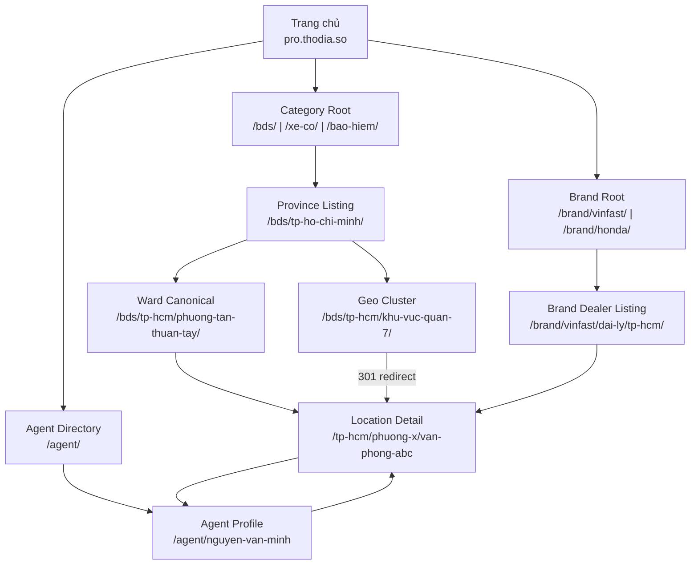

# Tổng hợp & Hướng dẫn triển khai Local SEO
> Pro.Thodia.so | Master Reference Document

---

## Executive Summary

Pro.Thodia.so cần xây dựng **3 loại page** với SEO chuẩn mực cao nhất:

| Page Type | Entity | Mục tiêu SEO chính |
|-----------|--------|-------------------|
| **Agent Page (Location-based)** | Đại lý gắn với Location | Rank cho "[đại lý] [brand] [phường]" |
| **Agent Page (Freelance)** | Đại lý độc lập, không có địa điểm | Rank cho "đại lý [brand] tập nhà", Service Area |
| **Location Page** | Địa điểm kinh doanh (showroom, văn phòng) | Rank cho "[đại lý] [brand] [phường]", local pack |
| **Brand Page** | Thương hiệu (Vinfast, Honda, Manulife...) | Rank cho "đại lý [brand] [tỉnh/TP]" |

---

## 1. Kiến trúc tổng thể (Architecture Overview)



**Nguyên tắc cốt lõi**:
- Brand Page → Brand Dealer Listing → Location Page = Brand-SEO funnel
- `khu-vuc-{quan}` = Geo Cluster (index, capture search volume tên quận cũ)
- `{phuong-slug}` = Canonical URL (cấu trúc hành chính mới 2025)
- Agent Page ↔ Location Page = Cross-linking hai chiều

---

## 2. Thông tin cần thiết — Summary Table

### Agent Page (16 required + 6 recommended fields)

| # | Field | Bắt buộc | SEO Impact |
|---|-------|----------|-----------|
| 1 | Tên đầy đủ | ✅ | H1, schema, title |
| 2 | Ảnh đại diện | ✅ | CTR, E-E-A-T |
| 3 | Chức danh | ✅ | Schema jobTitle |
| 4 | Số chứng chỉ | ✅ | E-E-A-T |
| 5 | Số điện thoại | ✅ | NAP, click-to-call |
| 6 | Email | ✅ | Contact |
| 7 | Loại đại lý | ✅ | Category alignment |
| 8 | Khu vực phục vụ | ✅ | areaServed schema |
| 9 | Địa chỉ văn phòng | ✅ | NAP, LocalBusiness |
| 10 | GPS coordinates | ✅ | geo schema |
| 11 | Bio 150+ từ | ✅ | Content depth |
| 12 | Danh sách dịch vụ (≥3) | ✅ | Topical relevance |
| 13 | Giờ làm việc | ✅ | openingHours schema |
| 14 | GBP URL | ✅ | sameAs schema |
| 15 | Facebook URL | ✅ | sameAs schema |
| 16 | Số năm kinh nghiệm | ✅ | E-E-A-T |
| 17 | Brand được ủy quyền (`authorized_brands`) | ✅ (xe/bảo hiểm) | Brand schema, E-E-A-T |
| 18 | Mã đại lý brand (`brand_dealer_code`) | 🔵 | Trust signal |
| 19 | Portfolio (5-10 giao dịch) | 🔵 | Trust signals |
| 20 | Testimonials (3-5) | 🔵 | Review schema |
| 21 | Video giới thiệu | 🔵 | Engagement |
| 22 | Chứng chỉ nghề nghiệp | 🔵 | E-E-A-T |
| 23 | Tên công ty/sàn | 🔵 | Organization schema |
| 24 | Ngôn ngữ phục vụ | 🔵 | International |

### Location Page (18 required + 8 recommended fields)

| # | Field | Bắt buộc | SEO Impact |
|---|-------|----------|-----------|
| 1 | Tên location | ✅ | H1, name schema |
| 2 | Địa chỉ đầy đủ (`ward` + `legacy_district` + `city`) | ✅ | NAP dual-structure |
| 3 | Mã bưu điện | ✅ | postalCode schema |
| 4 | GPS (lat/lng, 7 chữ số) | ✅ | geo schema |
| 5 | SĐT chính | ✅ | NAP, telephone schema |
| 6 | Email | ✅ | Contact |
| 7 | Loại dịch vụ (category) | ✅ | Schema type |
| 8 | Giờ hoạt động (từng ngày) | ✅ | openingHours schema |
| 9 | Danh sách dịch vụ (≥3) | ✅ | hasOfferCatalog |
| 10 | Khu vực phục vụ (quận/huyện) | ✅ | areaServed schema |
| 11 | Business description (≥200 từ) | ✅ | Content depth |
| 12 | Ảnh exterior (≥1) | ✅ | image schema |
| 13 | Ảnh interior (≥2) | ✅ | Rich content |
| 14 | GBP URL | ✅ | sameAs schema |
| 15 | Google Maps embed | ✅ | Geo signals |
| 16 | Reviews (≥3 reviews hiển thị) | ✅ | Review schema |
| 17 | Aggregate rating | ✅ | AggregateRating |
| 18 | Facebook Page URL | ✅ | sameAs schema |
| 19 | Parking info | 🔵 | Convenience |
| 20 | Landmark gần đó (≥1) | 🔵 | Hyperlocal SEO |
| 21 | FAQ (3-5 câu) | 🔵 | FAQPage schema |
| 22 | Ảnh team | 🔵 | E-E-A-T |
| 23 | Video tham quan | 🔵 | Engagement |
| 24 | Payment methods | 🔵 | Completeness |
| 25 | Zalo OA URL | 🔵 | VN market |
| 26 | Phương tiện công cộng | 🔵 | Accessibility |

---

## 3. Schema Types — Quick Reference

| Loại đại lý | Schema Type cho Location | Schema Type cho Agent (Location-based) | Schema Type cho Agent (Freelance) | Brand Schema |
|-------------|--------------------------|----------------------------------------|-----------------------------------|--------------|
| BĐS | `LocalBusiness` + `RealEstateAgent` | `Person` + `RealEstateAgent` | `Person` only | `Brand` (sàn) |
| Xe cộ | `LocalBusiness` + `AutoDealer` | `Person` + `AutoDealer` | `Person` only | `Brand` (Vinfast/Honda...) |
| Bảo hiểm | `LocalBusiness` + `InsuranceAgency` | `Person` + `InsuranceAgency` | `Person` only | `Organization` (Manulife...) |
| **Brand Page** | `Organization` + `ItemList` | — | — | N/A |

---

## 4. URL Pattern — Quick Reference

```
AGENT PAGES:
/agent/{first-last-name-service-phuong}
VD: /agent/nguyen-van-minh-bds-phuong-tan-thuan-tay

LOCATION PAGES (canonical — dùng phường mới):
/{tinh-slug}/{phuong-slug}/{location-slug}
VD: /tp-ho-chi-minh/phuong-tan-thuan-tay/van-phong-bds-nguyen-van-minh

GEO CLUSTER PAGES (tên quận cũ — index, capture search volume):
/{tinh-slug}/khu-vuc-{quan-slug}/{location-slug} → 301 redirect → canonical

BRAND PAGES [Mới]:
/brand/{brand-slug}/
/brand/{brand-slug}/dai-ly/{tinh-slug}/
/brand/{brand-slug}/dai-ly/{tinh-slug}/{phuong-slug}/

CATEGORY PAGES:
/{service}/{tinh-slug}/
/{service}/{tinh-slug}/khu-vuc-{quan-slug}/   ← Geo Cluster
/{service}/{tinh-slug}/{phuong-slug}/          ← Canonical
```

---

## 5. Checklist triển khai — Theo thứ tự ưu tiên

### Giai đoạn 1 — Foundation (Tuần 1–2)
- [ ] Thêm `/brand/` vào URL taxonomy
- [ ] Xây dựng URL taxonomy theo đặc tả (phường canonical + khu-vuc Geo Cluster)
- [ ] Implement robots.txt chuẩn
- [ ] Setup sitemap index + **5** child sitemaps (thêm sitemap-brands.xml)
- [ ] RSS feed cho new listings + brand feeds
- [ ] Canonical tags + 301 redirect từ URL quận cũ về phường mới
- [ ] Geo meta tags dùng tên phường mới làm canonical

### Giai đoạn 2 — Schema (Tuần 2–3)
- [ ] `WebSite` + `Organization` schema trên homepage
- [ ] `Person` schema cho Agent Page (+ `brand` property)
- [ ] `LocalBusiness` (+ subtype) schema cho Location Page (+ `brand` property)
- [ ] `Organization` + `ItemList` schema cho Brand Page
- [ ] `BreadcrumbList` schema trên tất cả trang
- [ ] `AggregateRating` schema nơi có review
- [ ] `FAQPage` schema cho FAQ sections (bao gồm FAQ về địa chỉ cũ/mới)
- [ ] Validate toàn bộ với Rich Results Test

### Giai đoạn 3 — Content (Tuần 3–6)
- [ ] Agent Page template với **24** required/recommended fields
- [ ] Location Page template với **28** required/recommended fields
- [ ] Brand Page template với brand info + dealer list
- [ ] Bio/description guidelines cho đại lý (có dual-mention địa chỉ cũ/mới)
- [ ] Ảnh standards (dimensions, format, naming, alt text)
- [ ] Internal linking automation (parent → child → sibling)
- [ ] FAQ templates bản địa hóa (bao gồm FAQ giải đáp địa chỉ cũ/mới)

### Giai đoạn 4 — Citation & GBP (Tuần 4–8)
- [ ] GBP setup/verify cho mỗi location
- [ ] NAP master database tập trung
- [ ] Submit lên Tier 1 citations (GBP, Facebook, Zalo OA)
- [ ] Submit lên Tier 2 citations (Foody, Cungcap.vn, YP.vn)
- [ ] Review request workflow

### Giai đoạn 5 — Monitoring (Tháng 2+)
- [ ] Google Search Console setup per property
- [ ] Core Web Vitals monitoring
- [ ] Monthly NAP audit
- [ ] Review response SLA enforcement
- [ ] Sitemap re-submit khi add pages mới

---

## 6. Key Differences — Justdial vs Pro.Thodia.so

| Yếu tố | Justdial | Pro.Thodia.so |
|--------|----------|----------------|
| Thị trường | Ấn Độ (đại trà) | Việt Nam (cấp cao, niche) |
| Loại đại lý | Tất cả SME | BĐS, xe cộ, bảo hiểm |
| Schema focus | Generic LocalBusiness | Person + Specialized subtype |
| Review platform | Internal | GBP-linked + internal |
| Lead channel | Call/form | Zalo + Call + Form |
| URL structure | /{City}/{Service} | /agent/{slug} + /{tinh}/{location} |
| Content depth | Template generic | Unique per agent/location |

**Lợi thế cạnh tranh cần xây dựng**:
1. Schema chính xác hơn (Person + specialized subtype) → entity clarity tốt hơn
2. Nội dung unique thực sự cho từng agent/location → không bị "thin content"
3. Tích hợp Zalo/OTT là CTA chính → phù hợp thị trường VN
4. Verification huy hiệu → E-E-A-T cao hơn
5. GBP linking chặt → local pack performance tốt hơn

---

## 7. Bài học từ DAN+DAN & Justdial áp dụng cho Pro.Thodia.so

### Học từ DAN+DAN Microsite
| Kỹ thuật DAN+DAN | Áp dụng cho Pro.Thodia.so |
|------------------|--------------------------|
| Brand+Generic+Geo trong title/H1/URL | `[Agent Name] - [Service] [District] [City]` |
| Địa chỉ viết dạng câu tự nhiên | "Văn phòng tọa lạc tại [địa chỉ đầy đủ], gần [landmark]..." |
| Silo GEO (Province → District → Location) | URL hierarchy + internal linking |
| Plus Code, W3Words | Thêm Plus Code vào schema geo |
| Review với bản dịch (nếu cần) | Hỗ trợ bilingual nếu target expats |

### Học từ Justdial Architecture
| Kỹ thuật Justdial | Áp dụng cho Pro.Thodia.so |
|-------------------|--------------------------|
| City+Service page = xương sống SEO | `/bds/tp-ho-chi-minh/quan-7/` là hub |
| Template động + nội dung thật | DB chuẩn hóa + content unique |
| NAP inject tự động từ DB | Master NAP DB → sync mọi nơi |
| UGC (review, Q&A) tạo content | Review platform + FAQ |
| AMP cho listing pages | Optimize mobile performance |

---

## 8. Rủi ro SEO cần tránh

| Rủi ro | Mô tả | Cách phòng ngừa |
|--------|--------|----------------|
| Duplicate content | Agent + Location copy content nhau | Content uniqueness rule: ≥30% unique |
| NAP inconsistency | Tên/địa chỉ khác nhau trên platform | Master NAP DB, không nhập tay |
| Thin location pages | Location page ít hơn 200 từ | Content template bắt buộc |
| Indexing pollution | Search/filter pages bị index | Robots.txt + noindex |
| Schema errors | Required fields thiếu | Rich Results Test trước khi publish |
| Over-templating | 100% trang giống nhau | Kiểm soát % content unique |
| GBP-Website mismatch | NAP trên site khác GBP | Weekly sync check |
| VN Admin confusion | URL quận cũ không redirect về phường mới | 301 redirect map đầy đủ + Geo Cluster pages |
| Fake brand dealer | Đại lý giả mạo thương hiệu | Xác minh mã đại lý + brand portal link |
| Brand content copy | Copy mô tả từ website brand | Viết mô tả đại lý độc lập, không copy brand.com |
| **Freelance Agent mis-typed** | Điền địa chỉ cố định cho freelance agent | Bắt buộc `agent_type` field; nếu freelance thì block điền address |
| **SAB GBP không verify** | Freelance GBP không xác minh bị ẩn | Yêu cầu điền số điện thoại xác minh với Google |

---

## 9. Đo lường thành công

### 6 tháng đầu — Mục tiêu

| Metric | Baseline | Target |
|--------|---------|--------|
| Agent pages indexed | 0 | 95%+ |
| Location pages indexed | 0 | 95%+ |
| Avg. position (brand+location) | N/A | Top 5 |
| Local pack appearances | 0 | ≥3 keywords/location |
| GBP calls/location/tháng | 0 | ≥20 |
| Review rating avg | N/A | ≥4.2 |
| Schema errors | N/A | 0 |
| Core Web Vitals pass | N/A | ≥80% pages |

---

## Version Tracking
| Version | Ngày | Thay đổi |
|---------|------|---------|
| 1.3.0 | 2026-05-06 | Bổ sung Freelance Agent type vào exec summary, cập nhật schema table 4 cột, thêm rủi ro Freelance mis-typed và SAB không verify |
| 1.2.0 | 2026-05-06 | Bổ sung Brand Page vào kiến trúc tổng thể, dual-structure URL VN admin |
| 1.0.1 | 2026-05-06 | Bổ sung Section 10: Category/Province/District Listing Page spec |
| 1.0.0 | 2026-05-06 | Khởi tạo master reference document |

---

## 10. Category Listing Pages — Spec bổ sung

> Đây là tầng quan trọng trong kiến trúc Justdial-style: Province + District listing pages

### 10.1 Province Listing Page (`/bds/tp-ho-chi-minh/`)

**Mục tiêu**: Hub page tập hợp tất cả đại lý BĐS tại TP.HCM, rank cho "môi giới BĐS TP.HCM"

**Required content**:
- H1: "Đại lý [Dịch vụ] uy tín tại [Tỉnh/Thành phố]"
- Intro paragraph: 100–150 từ unique về thị trường tại tỉnh đó
- Danh sách locations/agents với card (tên, địa chỉ, rating, SĐT, CTA)
- Bộ lọc: Quận/Huyện, Rating, Dịch vụ con
- Pagination với `rel="next"` / `rel="prev"`
- Số lượng đại lý hiển thị rõ: "127 đại lý BĐS tại TP.HCM"

**Schema**: `CollectionPage` + `BreadcrumbList` + `ItemList`

**URL**: `/bds/tp-ho-chi-minh/` — canonical, không có trailing params

### 10.2 District Listing Page (`/bds/tp-ho-chi-minh/quan-7/`)

**Mục tiêu**: Hub page tập hợp đại lý theo quận, rank cho "môi giới BĐS Quận 7"

**Required content** (tránh thin content — rủi ro lớn nhất):
- H1: "Đại lý [Dịch vụ] tại [Quận/Huyện], [Tỉnh]"
- **Local context section** ≥ 150 từ: Mô tả đặc điểm thị trường quận, landmarks, khu vực nổi bật
- Danh sách agents/locations trong quận
- Bộ lọc: Phường, Rating, Loại dịch vụ
- Map embed khu vực

**Lý do cần local context**: Justdial bị chỉ trích vì trang province/city "mỏng" nội dung — đây là điểm cần vượt trội hơn.

**Schema**: `CollectionPage` + `BreadcrumbList` + `ItemList` + `City`

### 10.3 Nội dung Local Context — Template
```
[Quận/Huyện] là khu vực [đặc điểm nổi bật] thuộc [Tỉnh/Thành phố],
với [số lượng] [loại tài sản/dịch vụ] đang hoạt động theo ghi nhận mới nhất.

Khu vực nổi bật tại [Quận] bao gồm [Phường 1, Phường 2, Phường 3].
Các landmark trọng tâm: [Landmark 1], [Landmark 2].

[1-2 câu về xu hướng thị trường địa phương hoặc đặc điểm khách hàng điển hình.]

Dưới đây là danh sách [X] đại lý [dịch vụ] uy tín tại [Quận/Huyện]
đã được xác minh thông tin trên Pro.Thodia.so.
```

---

## Tài liệu liên quan trong /z68-docs/
- `01-agent-page-spec.md` — Đặc tả Agent Page (có brand fields, VN admin)
- `02-location-page-spec.md` — Đặc tả Location Page (có brand + dual-address)
- `03-url-sitemap-rss-robots.md` — URL, Sitemap (+ brands), RSS, Robots.txt
- `04-local-seo-health-checklist.md` — SEO checklist & monitoring
- `05-master-reference.md` — Tài liệu này (tổng hợp)
- `06-brand-page-spec.md` — **[Mới]** Đặc tả Brand Page (Vinfast, Honda, Manulife...)
- `07-vn-admin-seo-strategy.md` — **[Mới]** Chiến lược SEO thay đổi hành chính VN
